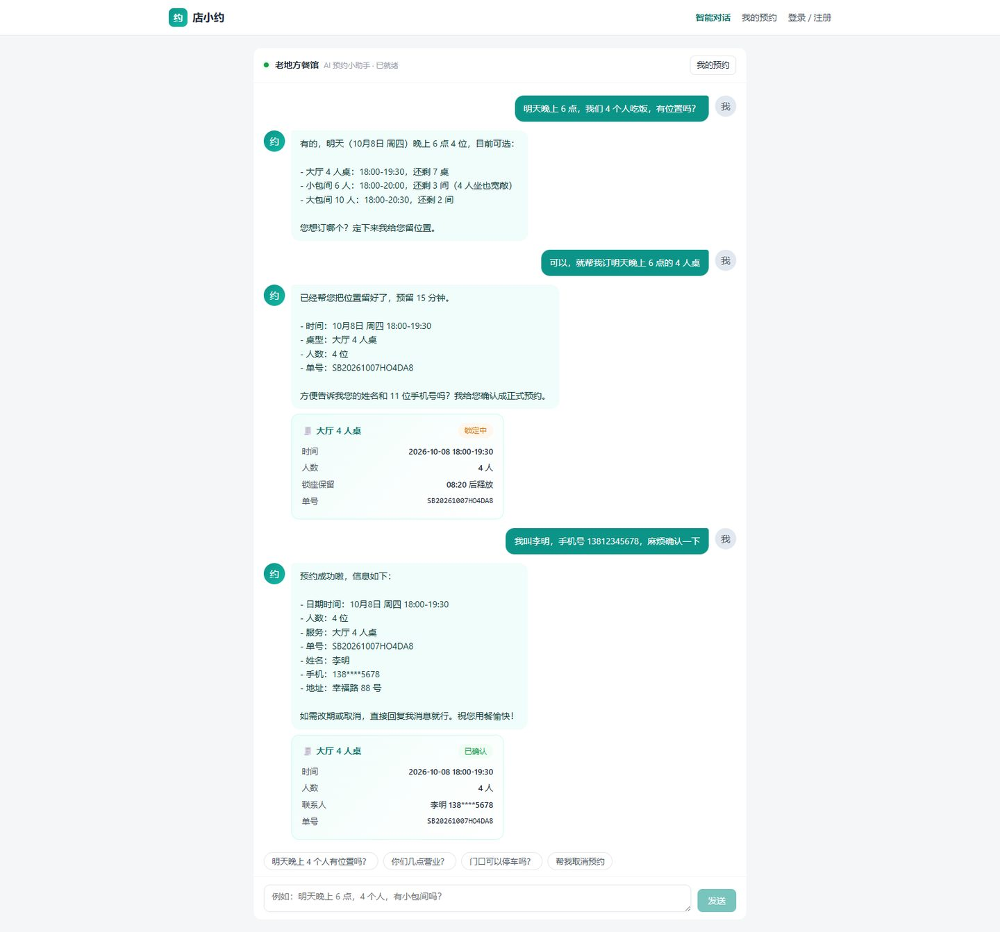
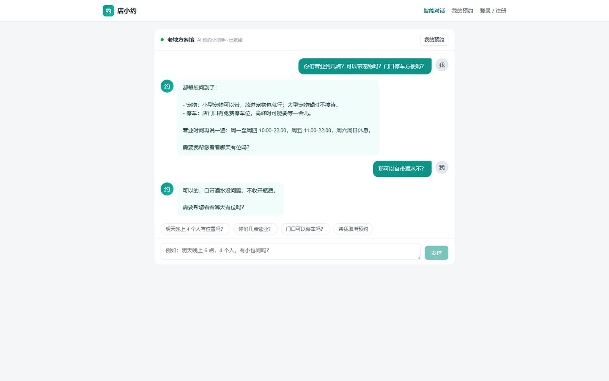
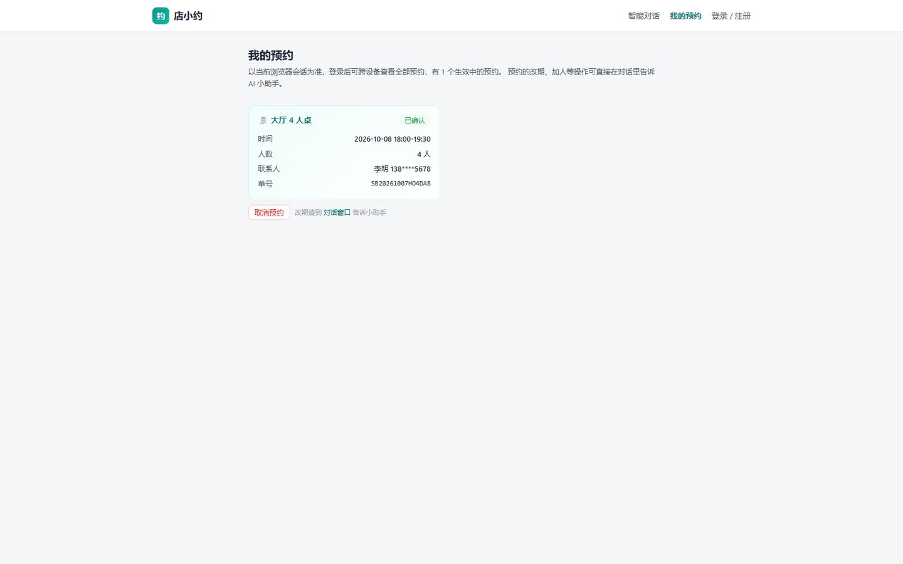
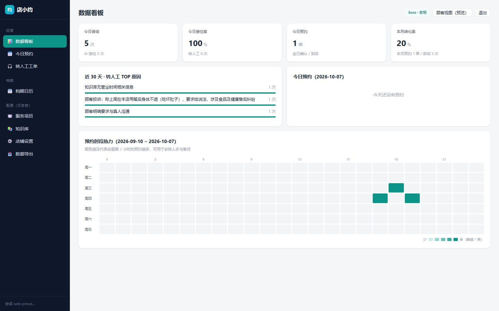
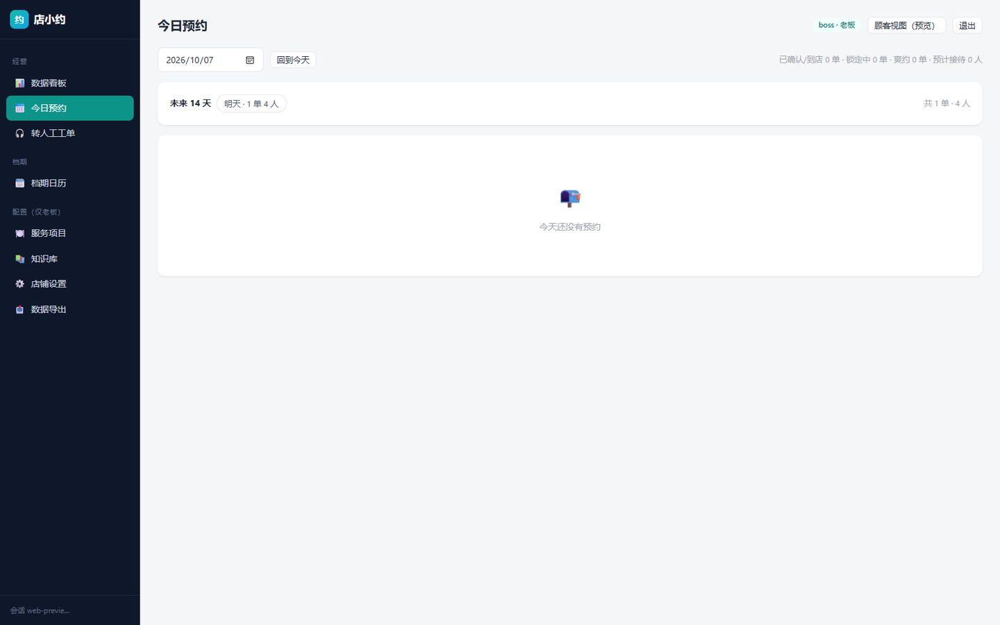
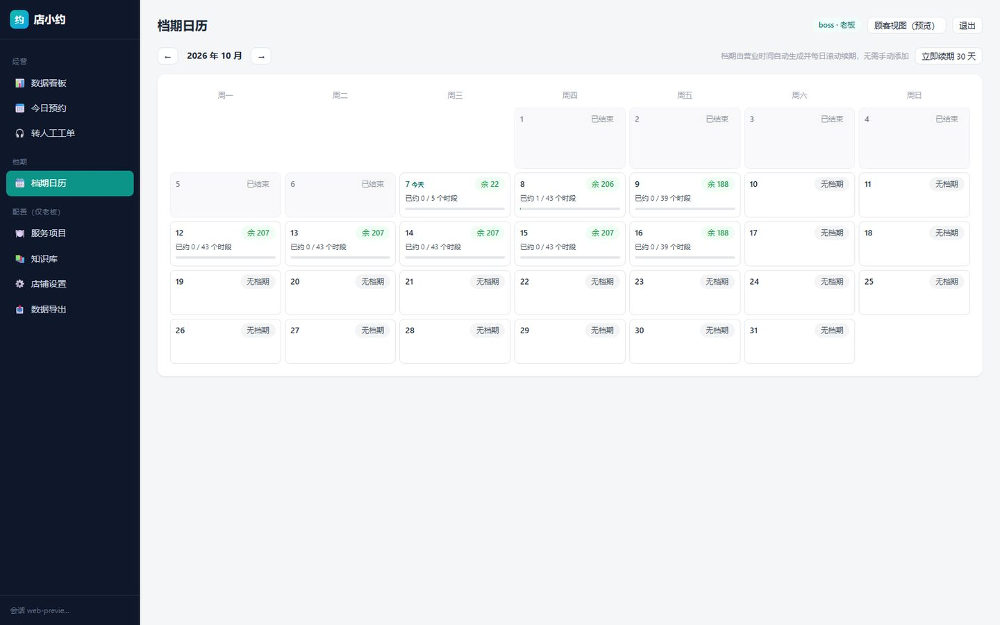
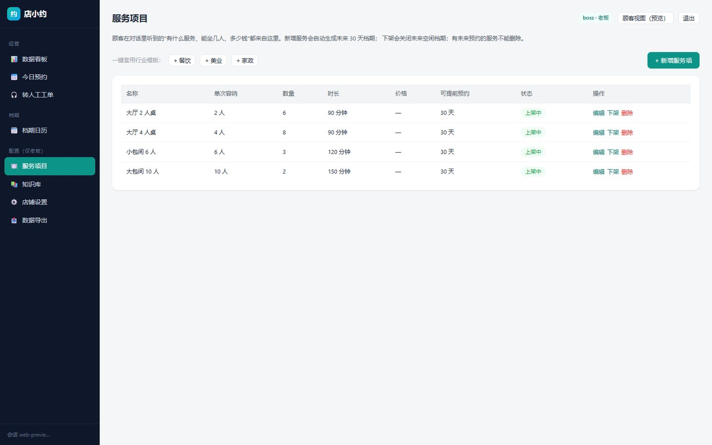
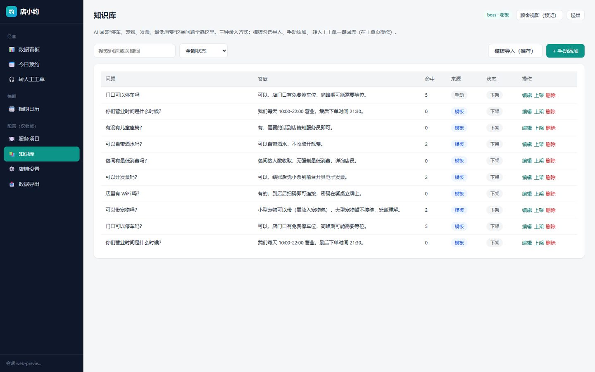
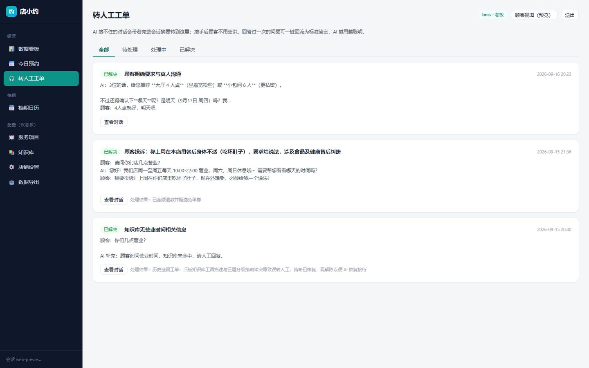
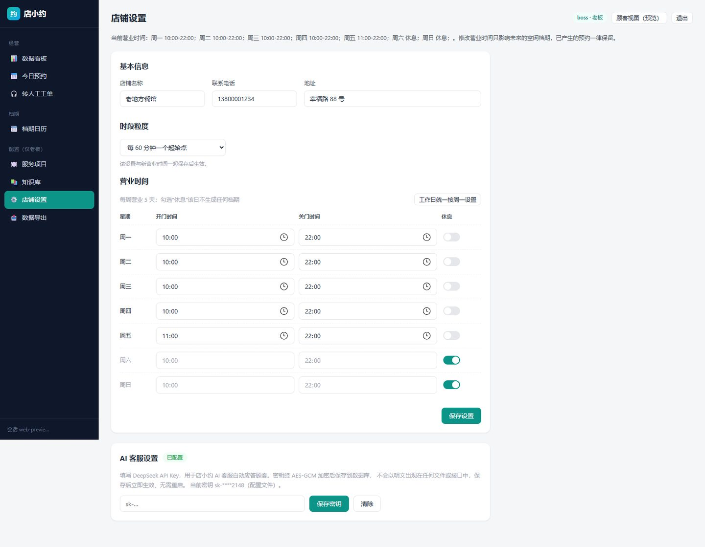

# 店小约 · 界面展示

> 面向小微商户的 AI 预约助手。DeepSeek Agent 工具调用自动查档期、锁座位、生成预约单，知识库问答覆盖常见咨询，投诉等特殊情况转人工工单。以下均为系统真实运行截图。

**技术栈**：React 18 · Spring Boot 3 · MySQL 8 · Redis · DeepSeek Agent

## 分页截图

### 1. 智能对话 · AI 预约全流程（查位→锁座→确认）

顾客一句话查位，AI 调用工具查询真实档期并推荐桌型；确认后自动锁座建单，生成结构化预约卡片，锁座 15 分钟内有效。

### 2. AI 知识问答 · 常见咨询

营业时间、宠物、停车、自带酒水等问题由商家知识库直接应答，一次提问多问齐答。

### 3. 我的预约 · 状态卡片

### 4. 老板端 · 经营看板

### 5. 老板端 · 预约管理

### 6. 老板端 · 档期日历

### 7. 老板端 · 服务项目管理

### 8. 老板端 · 知识库维护

### 9. 老板端 · 转人工工单

### 10. 老板端 · 店铺设置

