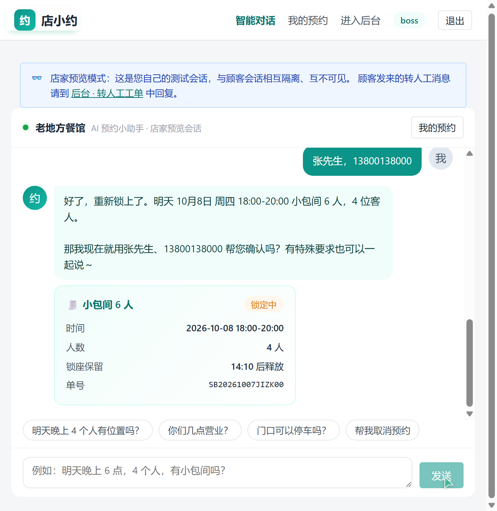
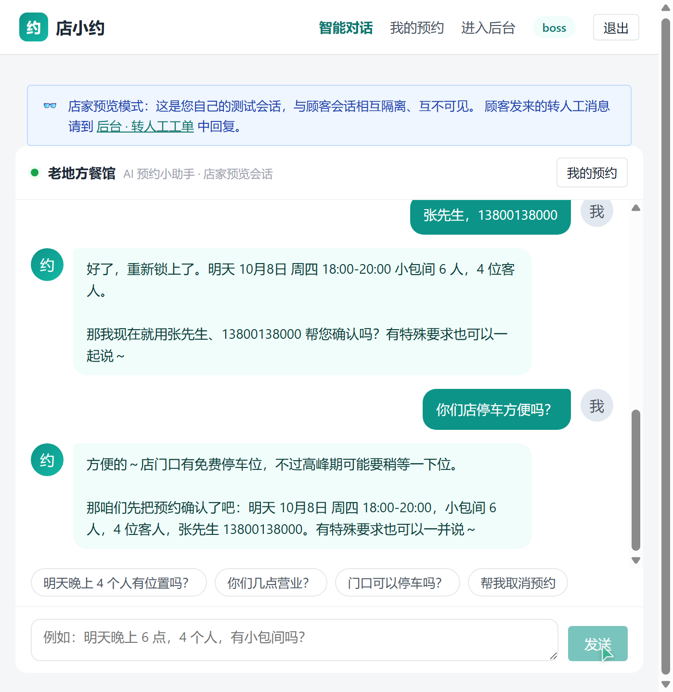
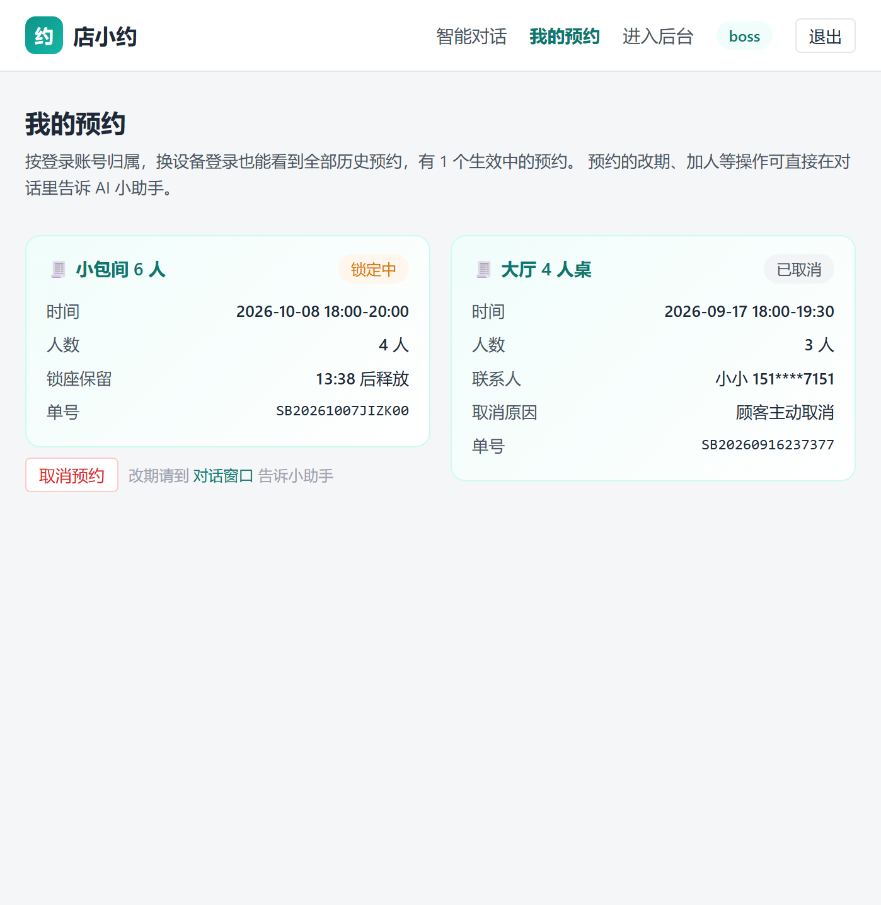

# 店小约 · 界面展示

> 面向小微商户的 AI 预约助手。DeepSeek Agent 工具调用自动查档期、锁座位、生成预约单，知识库问答覆盖常见咨询。以下均为系统真实运行截图。

**技术栈**：React 18 · Spring Boot 3 · MySQL 8 · Redis · DeepSeek Agent

## 界面总览

## 分页截图

### 1. 智能对话 · AI 预约全流程（自动锁座）

### 2. AI 知识问答 · 咨询与预约引导

### 3. 我的预约 · 状态卡片

### 4. 档期管理

### 5. 服务项目管理

### 6. 商家知识库维护

